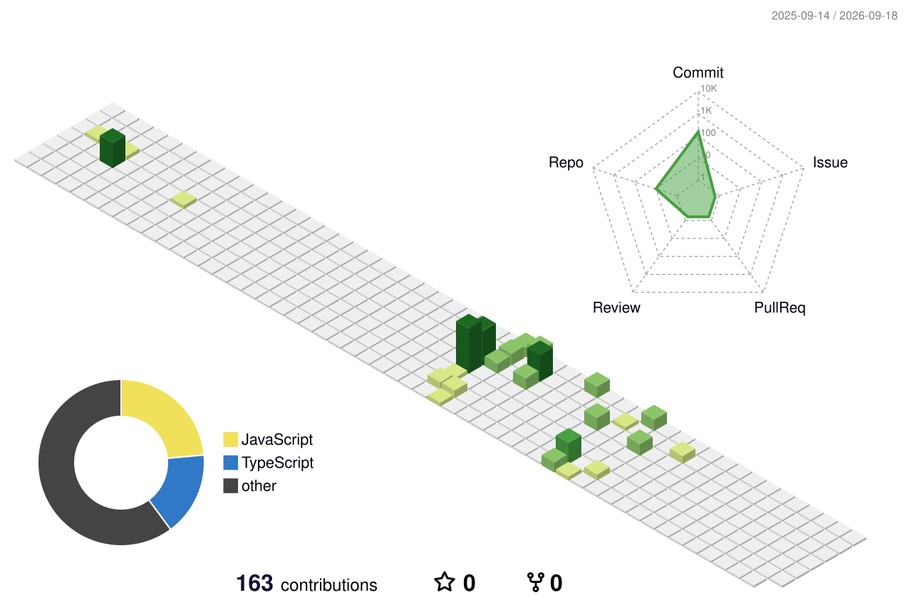

---

## 👨‍💻 About Me

<table>
  <tr><td>💼 <strong>Role</strong></td><td>Frontend Intern @ Qveto Technologies</td></tr>
  <tr><td>⏱️ <strong>Experience</strong></td><td>0–1 years (Graduate)</td></tr>
  <tr><td>📍 <strong>Location</strong></td><td>India</td></tr>
  <tr><td>📫 <strong>Email</strong></td><td>neshat306@gmail.com</td></tr>
</table>

Frontend Developer building responsive web apps with React.js, JavaScript, HTML5, and CSS3. Currently developing a full-stack Job Portal using React, Vite, Tailwind CSS, and Supabase. Physics graduate — I approach UI problems analytically, not just visually. Comfortable with Git/GitHub and cross-browser compatibility.

---

## 🛠️ Tech Stack

<table>
  <tr>
    <td align="left" valign="top" width="150"><strong>💻 Languages</strong></td>
    <td valign="middle"> </td>
  </tr>
  <tr>
    <td align="left" valign="top" width="150"><strong>🎨 Frontend</strong></td>
    <td valign="middle"> </td>
  </tr>
  <tr>
    <td align="left" valign="top" width="150"><strong>⚙️ Backend</strong></td>
    <td valign="middle"> </td>
  </tr>
  <tr>
    <td align="left" valign="top" width="150"><strong>🗄️ Databases</strong></td>
    <td valign="middle"> </td>
  </tr>
  <tr>
    <td align="left" valign="top" width="150"><strong>☁️ DevOps & Cloud</strong></td>
    <td valign="middle"></td>
  </tr>
  <tr>
    <td align="left" valign="top" width="150"><strong>🛠️ Tools</strong></td>
    <td valign="middle">     </td>
  </tr>
</table>

---

## 📊 GitHub Analytics

  

  

  

---

## 🚀 Featured Projects

### 📌 [Job Tracker](https://github.com/imneshat7/job-tracker)

> A full-stack job application tracker built with React and Supabase. Track every application, update statuses, and filter by stage — all with per-user authentication and data isolation.

**Built with:** `React.js Vite Tailwind CSS Supabase (Auth + PostgreSQL) Vercel TypeScript`

### 📌 [Job Board Platform](https://github.com/imneshat7/job-board)

> A full-stack job portal web app where users can browse, search, and filter job listings with data served from a live database.

**Built with:** `React 18 Vite Tailwind CSS v3 React Router DOM Supabase (PostgreSQL database + REST API) Vercel (deployment)`

### 📌 [Generic Find](https://github.com/imneshat7/genericfind)

> AI-powered generic medicine finder using the Gemini API. Secure Node.js/Express backend on Render protects API keys. Built with React, Vite, and deployed on Vercel.

**Built with:** `JavaScript   React.js   Tailwind CSS   Cascading Style Sheets (CSS)   HTML   vite   Vercel V0   supabase   Git`

---

## 🌐 Connect With Me

  
  
  
  

---

  

